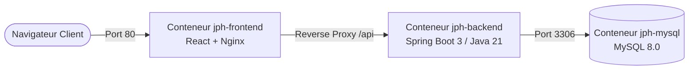

# 🐳 Guide de Déploiement DevOps avec Docker & Docker Compose

Ce guide explique comment lancer l'intégralité du projet **JPH** (Base de données MySQL, Backend Spring Boot 3 et Frontend React/Nginx) en une seule commande grâce à Docker Compose.

---

## 📌 Architecture des Conteneurs



| Service | Conteneur | Port Externe | Description |
| :--- | :--- | :--- | :--- |
| **db** | `jph-mysql` | `3306` | Base de données MySQL 8.0 (`pdr_reporting_db`) |
| **backend** | `jph-backend` | `8080` | API REST Spring Boot 3 avec Java 21 |
| **frontend** | `jph-frontend` | `80` | Application Web React servie par Nginx |

---

## 🚀 Commande de Lancement Rapide

À la racine du projet, exécutez la commande suivante :

```bash
docker compose up --build -d
```

> **Explication des options :**
> - `--build` : Reconstruire les images Docker (Backend & Frontend) avec les dernières modifications du code.
> - `-d` : Mode détaché (exécute les conteneurs en arrière-plan).

---

## 🔍 Vérification & Accès

### 1. Accès à l'application Web
Ouvrez votre navigateur sur :
👉 **`http://localhost`**

### 2. Accès direct à l'API REST Backend
L'API REST est accessible sur :
👉 **`http://localhost:8080/api`**

### 3. Vérifier le statut des conteneurs
```bash
docker compose ps
```

### 4. Consulter les logs en direct
```bash
# Tous les services
docker compose logs -f

# Seulement le backend
docker compose logs -f backend
```

---

## 🛑 Arrêter l'application

Pour stopper tous les conteneurs sans supprimer les données enregistrées dans MySQL :
```bash
docker compose stop
```

Pour stopper et supprimer complètement les conteneurs et réseaux :
```bash
docker compose down
```

Pour supprimer également les volumes de données MySQL :
```bash
docker compose down -v
```

---

## 💡 Conseils pour la Soutenance (Présentation au Jury)
1. **Lancement instantané** : Montrez au jury comment l'application démarre entièrement en une commande (`docker compose up`).
2. **Isolation & Portabilité** : Expliquez que grâce à Docker, l'application s'exécute de manière identique sur n'importe quelle machine sans nécessiter l'installation préalable de Java, Node.js ou MySQL localement.
3. **Multi-staging Build** : Mentionnez que les `Dockerfile` utilisent le pattern **Multi-Stage Build** (compilation Maven/Node dans la 1ère étape, puis image d'exécution minimale JRE/Nginx dans la 2nde étape) pour optimiser la sécurité et la taille des images.
